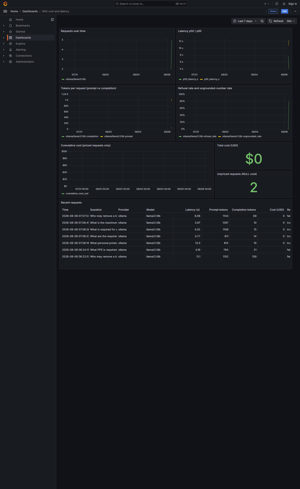

# RAG Knowledge Assistant (OSHA 29 CFR 1910)

Retrieval-augmented Q&A over OSHA general industry regulations, with
citation validation, hallucination checks, and role-based access control,
exposed over HTTP.

## Stack

- Postgres 16 + pgvector (Docker), 965 chunks embedded with `nomic-embed-text`
- Generation via `llama3.1:8b` (Ollama)
- FastAPI + Uvicorn, JWT auth (PyJWT), password hashing (Passlib/bcrypt)

## Running the API

Prerequisites: `docker compose up -d` (Postgres) and Ollama running locally
with `nomic-embed-text` and `llama3.1:8b` pulled.

```bash
pip install -r requirements.txt
python -m api.seed_users        # creates the two demo users, see below
python -m uvicorn api.main:app --host 127.0.0.1 --port 8000
```

Endpoints:

- `GET  /health` -- liveness plus chunk count
- `POST /auth/login` -- `{"username", "password"}` -> `{"access_token", "token_type"}`
- `POST /ask` -- requires `Authorization: Bearer <token>`; `{"question"}` ->
  answer, citations, citation report, ungrounded numbers, generation stats,
  and `retrieved`: for each paragraph its id, distance, heading trail, and
  **source text**

Each `retrieved` entry's `text` joins *every* chunk of that paragraph, not
just the highest-ranked one. That matters: a paragraph can split into prose
and table chunks, and the answer sometimes lives only in the table. Showing
the first chunk alone would silently omit it.

An authenticated `/ask` takes roughly 8-12s warm (mostly `llama3.1:8b`
generation time); this is a known, accepted characteristic of the
synchronous design for this phase -- see the plan's "Measured inputs".

## Running the web interface

With the API already running on port 8000:

```bash
cd web
npm install
npm run dev          # http://localhost:5173, proxies /api to :8000
npm test -- --run    # component tests
```

Log in with either demo user, ask a question, and click any citation to
expand the exact regulation text that produced the claim. Paragraphs the
model cited are shown distinctly from paragraphs that were retrieved into
context but never cited -- the latter matters, because when the model
mis-attributes a claim, the correct source is often sitting in that list.

If the system detects numbers in an answer that do not appear in the
retrieved text, it says so in a warning banner rather than hiding it.

## Demo users

Seeded by `python -m api.seed_users`:

| username | password       | roles              |
|----------|----------------|--------------------|
| viewer   | `viewer-pass`  | (none)             |
| officer  | `officer-pass` | `safety_officer`   |

`JWT_SECRET` is read from the environment; if unset it falls back to an
obviously-a-dev value (`dev-secret-change-me-before-deploying-anywhere-real`)
defined in `api/auth.py`. Set a real `JWT_SECRET` before deploying anywhere
that matters.

## Role gating is synthetic

All OSHA 29 CFR text in this corpus is public domain -- none of it is
actually confidential. `db/002_access_control.sql` gates chunks under
`1910.147` (Lockout/Tagout) behind a `safety_officer` role purely to
**demonstrate that access control is enforced end to end**: the permission
check lives inside the retrieval SQL (`WHERE required_role IS NULL OR
required_role = ANY(roles)`), not filtered out of results after the fact,
and a caller's roles come only from their signed JWT -- the `/ask` request
body cannot claim roles for itself. This is not a real content-sensitivity
classification.

## Live verification: the same question, two users

Both demo users were logged in and asked the identical question whose
answer lives only in gated `1910.147` content:

> Who is allowed to remove a lockout device from an energy isolating device?

**viewer** (no roles) -- retrieved only `1910.137` (PPE) paragraphs, cited
nothing, and declined gracefully:

> "The provided text does not contain information about who is allowed to
> remove a lockout device from an energy isolating device."

No `1910.147` paragraph appeared anywhere in the viewer's `retrieved` list
or `citations` -- zero leakage of gated content.

**officer** (`safety_officer`) -- retrieved ten `1910.147` paragraphs and
answered correctly, with a valid citation:

> "According to [1910.147(e)(3)], each lockout or tagout device shall be
> removed from each energy isolating device by the employee who applied the
> device. However, if the authorized employee who applied the lockout or
> tagout device is not available, it may be removed under the direction of
> the employer, provided that specific procedures and training for such
> removal have been developed, documented and incorporated into the
> employer's energy control program."

Both requests returned `200` -- the ungated user got a graceful refusal, not
an error. Note the viewer received a *full* set of ten results drawn from
permitted content, not a truncated list. That is the point of filtering
inside the query rather than afterwards: post-filtering would have returned
fewer results with no signal that anything had been withheld. Authenticated `/ask` latency: officer's request (warm model) took
11.4s wall / 8.2s generation; viewer's request included a 9.7s Ollama model
load, giving 21.0s wall / 13.7s generation. Full request/response bodies are
recorded in `.superpowers/sdd/p4a-task-345-report.md`.

## Cost and latency dashboard

Every `/ask` writes one row to `request_log` (tokens, latency, citation and
refusal counts, and a computed `cost_usd`). A Grafana dashboard reads that
table directly -- no Prometheus, since Postgres is already running and the
interesting questions are per-request, not aggregate scrape rates.

```bash
docker compose up -d          # Postgres + Grafana
python -m uvicorn api.main:app --host 127.0.0.1 --port 8000
```

Open `http://localhost:3000` (admin/admin by default -- change it or skip
the prompt). The dashboard "RAG cost and latency" is provisioned from
`grafana/dashboards/rag.json` at container start, so it survives a volume
wipe; it is not something clicked together in the UI. Grafana binds to
`127.0.0.1:3000` only -- the API is meant to be public, this dashboard is
not.

Panels: requests over time, latency p50/p95, tokens per request (prompt vs
completion), cumulative cost with a companion count of unpriced (NULL-cost)
requests, refusal rate and ungrounded-number rate, and a table of recent
requests. All group by provider/model where relevant, so a provider switch
shows up as a step in the chart rather than a discontinuity.



**Measured, not manufactured:** the screenshot above was taken after 7 real
`/ask` calls as `officer` (5 in this verification pass, plus 2 from earlier
testing), all served by local Ollama (`llama3.1:8b`). `SUM(cost_usd)` is
`$0` -- local inference has no marginal token cost -- and 2 of the 7 rows
show `cost_usd = NULL` (they predate the `cost_usd` column and were never
priced). The rate table in `scripts/rag/cost.py` already has Groq pricing
wired in; the first paid-provider request will show up as a nonzero step in
the cumulative-cost panel without any dashboard change.

## Retrieval quality, measured on two embedding backends

45 hand-verified questions (38 answerable, 7 negatives), every citation
machine-checked against the corpus. `nomic-embed-text` runs locally on
Ollama; `bge-base-en-v1.5` runs on Cloudflare Workers AI and is what the
deployed demo uses -- hosting a model was the one thing the free tier could
not do. Both are 768-dim, so the schema is unchanged between them.

| Metric | nomic-embed-text (local) | bge-base-en-v1.5 (hosted) |
|---|---|---|
| Per-paragraph recall@5 | 0.92 | 0.88 |
| Per-paragraph recall@10 | 0.99 | 0.97 |
| Strict completeness@5 | 3/6 | 2/6 |
| Strict completeness@10 | 5/6 | 4/6 |

Reported as fractions where the denominator is 6, because one question
flipping is worth 17 points there -- that difference is noise, not a result.
The recall gap is real but small: the hosted model costs about four points at
k=5 and two at k=10.

Both backends fail on the same questions, nearly all in `1910.147`. That
points at chunking and intra-section competition rather than at either
embedding model -- see `docs/RETRIEVAL_FINDINGS.md`.

Answer-level metrics (citation validity 60/60, gold citation 35/38,
ungrounded numbers 0, refusal 7/7 hand-reviewed) were measured on
`nomic-embed-text` and have **not** yet been re-run against the hosted
backend.

### The swap is silent when it goes wrong

Queries must be embedded with the model that built the index. A mismatch
does not raise -- both models return valid 768-dim vectors, so retrieval
degrades quietly. When the eval was first run against a Cloudflare-built
index while still embedding queries through Ollama, every metric scored
0.00 and distances flattened to ~0.9, i.e. near-orthogonal. Nothing errored.
The eval harness is what caught it, which is the argument for having one.

## Testing

```bash
python -m pytest
```

All tests are hermetic -- `tests/test_auth.py` and `tests/test_api.py` stub
the DB connection, embedder, and generator, so the suite never touches
Postgres or Ollama.
